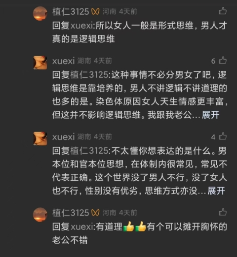

网络还是太奇怪了，他可以轻易的把一种表达转换为另一种表达，把一段讨论转变为争吵，把**错误**转变为**恶意**。

<!-- more -->

在看到恶意发言或者其他违规内容的时候，不知道别人，反正我会点**举报**，无论是为了网络环境，还是单纯的为了我上网的体验。目的不重要，重要的是，一次次，或许是真的因为违规判罚，或许是本身平台对于举报持支持态度，举报的成功率极高。

刚才看见一个视频，内容写的很好，很容易看出来是我最爱的理想主义者（？）但是视频是什么在这里和我要谈的主题暂时无关了，或许后来我会再写，或许不会，总归不在这里赘述了。要引出来的是评论区的内容，后面发生的也是我决定记录下来此时思考感想的起因：看图吧

楼主是xuexi，下文简称x，但我想说的主要人物其实是值仁，后面简称z。

在没有截到的其他回复中，没人看不出来是在理性讨论，可能有点激烈，但是都没有对任何人或事的恶意攻击。

唯独z评论，客观地看，可以肯定的是语言中明显体现出来浓厚的**刻板印象**，同时在其第二条评论中，其并没有看到x的理性，而是只看见x丈夫的优秀，依我的猜测（我不敢轻易确定地评价网络上的发言，这与本文主题亦有联系），z其人可能缺少辩证的思维，更激进一些，可能并不及楼里他人的理性思维（叠个甲，本人主观猜测，无恶意，无侮辱性轻视性贬低性）。

本人是女性，也常看到网络上如今日益兴起的女性觉醒以及其伴随的（有没有因果关系我不敢保证）日益严重性别对立现象。那些视频下往往充斥着尖锐的对立与黑色的恶意，像前文说的，这种评论区总会有被我举报的言论。

**习惯**性的，我想将这两条评论举报，未多思考，即将按下时不知被什么拦住了，我的大脑猛然像被移开了路上的障碍，说是豁然开朗实在夸张，但总归可以让思维通行了。（不太妙，我快要忘了当时的感觉了）我似乎是被动的盘了一下为什么点这个举报。

起初，最直接的想法，是性别歧视，引起对立，严重点说是引战，这是对于刚才描述的先前举报评论的原因。但我的**强制客观视角**告诉我（这一点要解释就太多了，似乎也和本文有关，但是依旧不赘述了（刚才现起的名字，写着写着同时在想，好形象啊，我真有才（（（））：**他的评论并没有恶意**，（中间的思考过程记不清了，结论是）z只是说错了，或者说，他只是持有一种，以我的三观来看，错误的观点而已。

想出这个结论的时候实是把我吓到了，明明他与他人无异只是发表自己的观点，全无恶意，为什么我不假思索的要去**举报**呢？

经过从当时起到写下这句话为止，我仍然不能肯定。（太晚了，我的思维要停滞了，但是还是要在明天忘掉这个感觉之前记录下来）

啊对，我想了几种可能，都不太美好。

一方面，网络上的文字是**死**的，而非鲜活的；语气是**主观**的、由看者所臆想的，而非由言者确定。这样的情况模糊了人们交流时的感情色彩，从而增加误会、曲解，一定程度上促进了网络的戾气增长，也是我对此误判的原因之一

一方面，多次举报的成功“经验”，助长了我的*正义感*。不得不说，这样的正义感实际上是盲目的，是愚昧的，是不正义的。又或许这种举报让我感受到了“**权力**”（我最不愿意设想的情况），这种权力使我盲目，让我在网络与道德层面均产生了傲慢。或许因此，我对此越来越轻视，越来越主观臆断，屏蔽了客观的声音，将理性置于次位。我虽不希望，但如果真的是这样，我会忏悔，祈祷不是吧（为什么突然玄学起来了）

还有一方面，我要想不起来了。想起来了，是错误。不知道为什么，现在人们总将错误看的太过严重，甚至将其视为恶意的、无理的。刚刚想到一个很好的类比，不知道有多少人小时候因为答错问题而被老师说“是故意的吧”。

又比如，侧面看，小时候觉得忘带红领巾都是天塌下来一样的错，不也反应了这种现象吗？我们对错误、甚至只是非主流的观点的**包容性**越来越低了，一再将其严重化、恶意化，这同样是现在网络乃至于生活中人们之间矛盾愈发尖锐、戾气愈加严重的原因之一。

写不动了，已经两点半了，可能还有别的想说的，也已经记不起来了，不过能记录下这些反思，不能说足够，但是尽力了）

> **他只是说错了**

ps：补充一点，还有一个因素是类似但怀有恶意的评论看的多了，产生刻板印象和惯性思维，但是归根结底是网络环境的问题，而网络环境又是上述问题造成的。这点当时也考虑进去了，但因为不是重点，被优先忘掉了，现在才想起来
